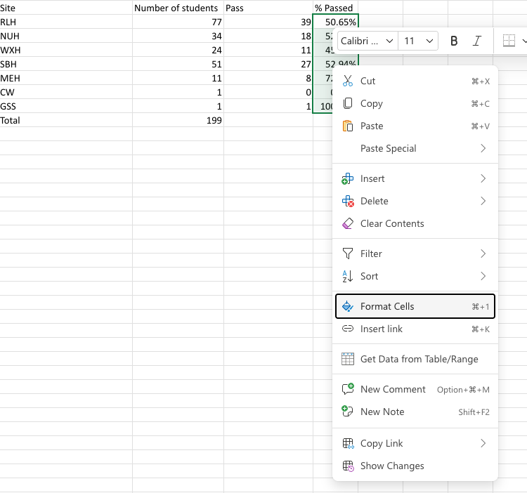

# Module 1 — Data Access, Cleaning & Analysis
### Barts Health NHS × La Fosse — Microsoft 365 Data Skills Training

**Day 1 | 09:00–11:45 | Platform: Excel Online**
**Five 30-minute blocks, with a 15-minute break after Block 3**

---

## Pre-Session Setup

- Load Slidee: barts_module_1_2


## Training

- `Slide 1`

### Personal Intro

Good morning everyone, good to be with you all today. 

My name's Emile and I'm a Senior Trainer for LaFosse. My role at LaFosse is a technical trainer, whether that's building websites, deploying software onto servers in the cloud or exploring databases and the data they contain. 

Susana who I trust you all know, and Simon from my team have been working on a plan for some training, which we've put together. Fundamentally the training revovles around the data lifecycle. 

From when an email lands in your inbox with an attatchment about attendance records, to understanding that data, getting the relevant insights out of it and then taking action. 

### Training Overview

- `Slide 2`

You may already be familiar with the training and how it's'structured but in case you're not. 

We'll be spending 2 mornings together. 

On the slide, you'll see the group we're in and also the corresponding second session. 

Additionally the 4 modules we'll be looking at, each one building on what we cover in the previous training. 

- `Slide 3`

So:
- Module 1
  - This is laying the foundation for everything that follows. Before any chart can be built or insight communicated, before we take a look at automating some of the processes with AI we need to make sure the data is trustworthy. 
  - This module is going to focus on the practical skills to get raw information or imperfect data as it may arrive across different systems into a clean and structured file. 

- Module 2
  - Module 2 is designed to convert that spreadsheet into something more meaningful. We'll discuss selecting the right chart for the message we're trying to communicate and then stripping away any noise which obscures that message. This is what we'll cover over the course of this morning, then we'll pick up again for Module 3 and 4.

- Module 3 & 4
  - I wont delve too deeply into those modules right now but they can be summarised by taking the learnings we hopefully achieve this morning and then making that process more efficient using CoPilot. We'll then conclude with a little exercise which takes us all the way through that process. 

### How to follow the training

It's my recommendation that during the training you ask questions as we go along. One of the things I say with all the training I deliver, your goal isn't to know everything but to be able to find out how to do different things and when we introduce CoPilot in the next session, that'll make life a lot easier. 

You can make notes if you wish but I've developed a cheatsheet for each module, which summarises the main takeaways. 

That's available to you in the SharePoint you've been invited to but we can distribute those as well. 

We'll also be recording the training so you'll have access to revisit this session at a later date if there's anything specific you want to recap.

### The Training

Ok, let's get into it then! 

#### The Data Lifecycle

When we discuss data, often we're inadvetently referring to a point along the Data Lifecycle.

- `Slide 4`

I hope you can see but it describes the journey data takes from it's origin through to an eventual action. 

We start with:
- **Collection**
  - Where we gather raw data from different source systems
- **Storage**
  - Where that data exists, which could be SharePoint, OneDrive or downloaded directly onto your computers
- Then we progress into **Access**
  - Essentially opening the data or spreadsheet
  - This is the phase where we'll be starting our training today
- Then **Cleaning**
  - We rarely get perfect data on arrival, so there's a profress of fixing any errors, blanks and any formatting requirements 
- **Analysis**
  - Analysis is actually defining different formulas in Excel and creating LookUps or Pivot Tables to bring relevant information together
- **Visualisation** is where we'll conclude today
  - Relatively straight forward but creating charts or illustrations about our data
- Then in our next session we'll look at **Communication**
  - Creating slides, reports... essentially distribtuing the insights more widely
- And finishing with **Action**
  - What do we actually do with that insights we have

Those last two parts we'll tackle more comprehensively in Modules 3 and 4. 


## Block 1 - Getting Data into Excel Online

So before we get started we need some data. 

You should have been invited to a SharePoint, I'll share the link on Teams as well just incase the invite has got lost. 

- *LINK*: https://lafosseassociatesltd.sharepoint.com/sites/BartsHealthxLaFosse

If you click into *Documents* on the left hand side you'll see a series of mock spreadsheets we'll be working from. 

The whole point of SharePoint is to share files or conversations within a team which is fine.

For the purpose of the training what I've done is created two folders for the different locations we'll be delivering this training.

Can I ask you all to:

1. Click into the folder for our current location and then in the top right hand side, you'll see a green *Create or upload* button. 

2. Could create a folder and name that folder your first and last name. 

So for me, I'll go into *Trainers* and just create a folder called *Emile Sherrott*

### The problem 

Most of the problems we have with data start before we've even opened a file. Data arrives from multiple sources and exported to a place like SharePoint in multiple formats from different teams.

In the files we have to work with I think we have a good example of this. In SharePoint you'll notice two files. 

- 0923 BSc Student allocations (LSBU-Barts Health)
- student allocations

Before we open these up to edit them, can I ask you to select both of these files from the Documents window - there should be a circular radio button on the left hand side of each file.

Then on the toolbar at the top click on 'Copy To', once you've done that just navigate to where you created the folder with your name and copy to that location. 


Whether this is something you need to do beyond the training is quite subjective. If there's information which needs to be protected then it's never a bad idea copy that file to work on it. However if you end up having 10 copies of the same file then as you can imagine, life gets more complicated organising everything. 


### Accessing Data

So once you've done that, just navigate in SharePoint to your named folder and let's open up both of files we copied over. 

I'll start by looking at: 0923 BSc Student allocations (LSBU-Barts Health)

It's likely you're better equipped to read this spreadsheet than myself but it looks like a student placement allocation spreadsheet for London South Bank University students and their clinical placements. 

Based on the worksheet title:
- **0923 BSc** likely a student cohort who started September 2023
- **PL7** a placement number
- **5 Jan- 22 Feb 26** - a placement period

Then some information about how long they'd be expected to spend on their placements. 

The column headings I hope are fairly self explanitory

- **Trust**
- **First name**
- **Surname**
- **Student email**
- **Placement Dates**
- Under **5 Jan- 22Feb 26** looks like the Allocated ward/department
- **LL** I believe to be the Link Lecturer 

I appreciate it may sound obvious but having an initial understanding of the data, what it contains is always the first thing we should do. 

Without that insight we can't start to identify any issues with the health of the data and then try to resolve them before we go any further.

- `Slide 4`

If we think back to the data life cycle, this is the **Access** stage. When we first open a file, we need to understand it and assess it's quality before we can start to clean or analyse it.

## Block 2 - Cleaning & Structuring Data

If we go back to the spreadsheet we can see there's a few anomalies with the data. 

- On row 21: We're missing data about the **Trust**, **Placement Dates** then the **Allocated ward and department** info.

- Between rows 36 and 39 we're missing data on the **Link Lecturer**

- Row 40 we're missing trust information with a few other things

- Then generally throughout the spreadsheet it looks like there's varying ways information has been inputted. 
  - On row 10 the trust is Barts-contin
  - On row 11 it's Barts-ext degree
  - On row 12 it's just BSc
  - On row 20 it's *from 0922* with a lower case *f*
  - Then on rows 30 & 31 it's *From 0922* with an upper case *F*
  - Finally row 35 the trust name is *Other*
 
 You'll have an understanding about the insights you generally want to collect from these types of reports but we can easily indentify that if we wanted to understand how many students were doing their placements in the Community, this spreadsheet alone couldn't answer that question with 100% accuracy. 

 We've got the 4 apprentices between rows 36 and 39. We could guess Kendall Martinez on row 35 is part of the community placement or that Quinn Gonzalez at the bottom is as well but they would just be assumptions.

 With 35 apprentices in total, 4 of which don't have the data regarding their placement location, that represents just over 11% of the entries. 

 Which is quite a large scew if this was an area we were running our analysis on. 

 ### Cleaning Data

 At this point we need to move into the next stage of the data lifecycle and clean our data. 

 #### White Space

 Generally speaking when we clean data the first thing we do is observe the issues with the data and where they are, which we have done.

 - There's multiple casings of trust information in column A. 
 - Missing values
 - There's also hard to interprete values we saw in column A


With any data, where we gather that information from may lead to a few vulnerabilities. 

It's not uncommon to see terminals outsite training spaces, where users type there name to sign in or register. If there's any user input when collecting data, there's always a risk that the input may contain issues. 

Generally speaking those issues look like spelling mistakes or whitespace before or after a name is written.

If I'm writing a simple query to see how many students are in a community placement I can write a formula to do so. 

- *Click into cell K42 and type*: "Number of students in community"
- *Click into cell L42 and type*

```xlsx
=COUNTIF(L6:L40,"Community")
```

- *Press Enter*

We should hopefully see **4** returned to us. 

`COUNTIF` is the formula and we have two inputs which are seperated by a comma. Technically we ought to refer to these as **arguments**

If I click into the parenthesies of the formula we can see the syntax or how the formula should be used.

We have a:
- **Description**, "counts the number of cells within a range that meet the given condition"

Then our two arguments

1. The range of cells we're assessing
2. The condition we're checking or the criteria

Generally speaking, we should be a little untrustworthy about our data, especially if we know it arrived from a place where there's a lot of human or manual input.

If I introduce a trailing white space to one of the cells with "Community", then we get 3 instead.

- *Add a trailing space into a cell with "Community"*
- *Show change*

So if there's any pieces of data which are typed in manually by a human it's always good to trim any leading or trailing white space. 

There's a few ways to clean it, hopefully we'll get CoPilot to do this for us in time, but I'll write a new function.

What I'll do is go through a process of creating new "cleaned data" then replacing old data. 

- *Click into cell S6*

```xlsx
=TRIM()
```

If I click inside the formula again, we can see the syntax of the formula

- **Description**: removes all spaces from a text string expect for single spaces between words
- It also takes one argument, the **text**

I'm going to add an extra layer to this and nest another formula inside the parenthesies of the **trim()**

```xlsx
=TRIM(CLEAN())
```

If I click inside the parenthesies related to **Clean()** we can see in the description, it says: "Removes all nonprintable characters from text"

If I were to press tab, inside an excel cell, that would be a non-printable character or if I copied over some information from a Word Document over several lines, that would contain what's called a "line break".

Both of these are harmless if we're just trying to read data directly from a spreadsheet but they can break formulas when we start to analyse the data at a later stage.

Let me provide a cell to perform these two formulas on. 

```xlsx
=TRIM(CLEAN(L6))
```

When I press Enter or Escape, Excel will first perform the Clean formula which will resolve in a certain value. Once that's complete excel will then perform the Trim. 

All I'll do now is drag down or "Auto Fill" for every entry in this column.

The result should be a cleaned column of data, which we can trust doesn't have any hidden pieces of formatting or white space.

Now I just want to overwrite the original column of data.

If I highlight column S then copy it, I can go to the original column *L6* and do a "Paste Special" which essentially let's me choose if I want to paste the formulas, values or the styling with formatting. 

I'll choose "Values Only" and it'll overwrite our original values with the clean ones. 

Finally we'll just need to delete the data we created in column S.

Hopefully we can see our **countif** formula is now correctly showing 4. 

This is something we could potentially do for all our text columns, but for sake of time we'll move onto other types of cleaning we can do. 

#### Standardise Casing

We noticed in our **Trust** column, column A, that the casing wasn't consistent on Row 20 and then Row 30 and 31. 

Once we've gone through the process of removing any problematic white space, generally this is what we'd want do next. 

It's a very similar process. Create a new column of cleaned data and then overwrite the original column.  

- *In cell S6 write:*

```xlsx
=PROPER()
```

If I click inside the parenthesies we can see the syntax again: "Converts a text string to proper case", basically the first letter in each word becomes uppercase with the other letters lowercase. 

We only have one argument to pass, the text. All I need to do is refer to the cell which holds the text I'm interested in. 

```xlsx
=PROPER(A6)
```

- *Then Auto Fill*

I'll just copy these values and do another Special Paste into the original row. Then we can delete *column S* again. 

As well as the *PROPER* function which will capitalise the first character of each new word we can also use:
- *LOWER()* which is useful for emails
- *UPPER()* which you may use with PostCodes

Most functions in excel actually aren't case sensetive but for data presentation and professionalism, it's a good step to include. 

#### Challenge

I'd like you to have a quick go yourself. 

In column J we have the **student emails**, again this could be the type of data each individual student as manually entered and we want to make sure it's cleaned.

The challenge is to overwrite this data with a cleaned version, and I want you to combine three different formulas together.

1. Clean - to remove those unprintable values
2. Trim - to remove white space
3. Lower - to ensure all text is in lower case

#### Solution

```xlsx
=TRIM(CLEAN(LOWER(J6)))
```


#### Standardised Values

Another thing we noticed was in the trust section we had values like: `0923 BSc Barts-Contin` on row 10. 

If there was an insight and the organisation just considered anything beginning with `0923 BSc Barts` to be the same cohort, it'd be difficult to extract this information from the data as it stands. 

So I'm going to clean this, however in this context I'm not going to overwrite any data but add to it.

- *Write in cell S6*:

```xlsx
=IF()
```

**'If'** is another built in formula, if we check the description it says: "Checks whether a condition is met, returns one value if true and another value if false"

Then we have three arguments:
1. The logical test
2. The value we return to the cell if the test is true
3. Then the value we return to the cell if the test is false

The test I want to conduct is basically to see whether the information held in the Trust coloumn begins with **"0923 BSc Barts"**, so it'd be True for rows, 6, 7, 8, 9, 10 and 11. 

For that first argument I'm going to nest another formula, a **countif**


```xlsx
=IF(COUNTIF(A6,"0923 BSc Barts*"))
```

This basically checks if the value in the cell A6 starts with "0923 BSc Barts" regardless of what may or may not follow. 

In my use case I essentially want a new column of the students original cohort, regardless of if it's currrently a **continued placement** or they've perhaps **extended their degree**

The second argument for the **IF** formula is just going to be what we want to return if our Logical Test returned True. 

```xlsx
=IF(COUNTIF(A6,"0923 BSc*"),"0923 BSc Barts")
```

Then if the condition returns False, I want to leave it as the original value. 

I can just refer to the original value in the cell to achieve this.

So if the logical test returns false, we just use the value we started with. 

```xlsx
=IF(COUNTIF(A6,"0923 BSc*"),"0923 BSc Barts",A6)
```

- *Then auto fill the other rows*

Instead of overwritting column A, I'm going to just define a new column heading. I'll call it "Original cohort"

- *In cell S5 type:* "Original cohort"

The reason I'll leave the original column is because in a couple of weeks if someone asks, *"how many students have extended their placement"*, we want to be able to answer them. 


#### Fill or Infer missing values

We won't clean the data anymore for the time being.

As we saw it's quite manual, and we could have spent more time looking at each individual row. As I said, eventually we'll be using CoPilot next session to hopefully achieve similar results. 

It's important though to understand what we're doing manually, so when CoPilot takes the reigns we know the actions it's taking. 

The last thing I want to talk about is the missing entries. 

Unfortunately, there's not a silver bullet to address these, but generally we have three options:

1. **Populate missing values**
  - This is seeing if there's another trusted source of data and adding in that information ourselves. 

  - On Row 32 we have **Quinn Martin** and we can see it's missing quite a few pieces of information:
    - Trust
    - Placement Dates
    - Where their placement is

  - If I open our second spreadsheet *student allocations*, on row 28, it looks like Quinn is based in A&E at the Royal London Hospital, so I can lift that information and add it to be first spreadsheet.

  - *In `0923 BSc Student allocatons (LSBU-Barts Health)` in cell L32 add:* `A&E RLH`

  We wont go through all of these due to time restrictions but if you're not guessing, this is fine. 

  You'll understand these spreadsheets better than myself and where the data arrives from. It'll be a judgement call on your part whether the information is reliable or not. 
  
  Apprentices may change where they're based so I'm making an assumption. Additionally thoguh we have information from their **LL** or **Link Lecturer** so we could, if the information was important reach out to them to populate this table. 

2. The second way we can fill in values to to **Derive them**
  - This is essentially using logic to fill in missing data.
  - In cell K32, we can see Quinn is missing this data as well.
  - As I said, you'll know these spreadsheets better than myself, but it looks like all the Placement dates are the same, so what I'll do is make the assumption and lift the date from other values in the spreadsheet.

  - *Copy `5 Jan-22 Feb '26` from another cell into K32*

3. Our final option with missing data is **Leave it blank**

  - From the data I have access to, I can't reasonbly infer the original cohort Quinn was on. 
  - An absence of data is better than incorrect data.
  - Generally speaking at this point you can flag for a review if it's important to fill out those values or acknoeledge that you're dealing with imperfect data. 

So as a general rule: Populate when you know, derive when there's an agreed approach to derive, leave blank if you have neither. 

#### Remove duplicates

After this we could remove duplicates if they existed but following that our data would be cleaned and ready to be assessed further. 


## Block 3 - Core Formulas for Analysis

So now that we've got clean data I want to take a look through a few more formulas. 

We've seen so far, **COUNTIF**, **IF** and a couple of others.

**ASK**
- Does anyone want to guess how many there are in total?

**ANSWER**
- 450

Practically, the way we can combine multiple formulas together through nesting, there's an almost infinte number of ways we can use these formulas.

I wouldn't expect anyone to know many of them, let alone the different arguments they recieve. 

It's far better to be able to use Google or CoPilot to search for formulas which let you achieve a certain task and then use the syntax Excel givs you to implement it, with the aid of a description and example. 

The reason we have these formulas, more generally though, they are how we turn a series of records into insights. 

A spreadsheet full of rows doesn't really tell us anything on its own. 

With formulas we can ask:
- how many?
- how much?
- which category?
- what proportion?

`COUNTIF` in particular are the workhoreses of administrative reporting. 

Another forumla which is probably worth remembering is `IFERROR`, the main reason is because, if a formula displays an error, often to a senior stakeholder, that reads as carelessness, even if the underlying issue is the data that was shared with you by that stakeholder. 

We can wrap formulas in a `IFERROR`, which is a small habit but improves the credibility of a report significantly. 

To show case these I want to use a new spreadsheet: `L&D learner tracker FG`, if we can go through the same process of copying it into our personal folder. 

- *Copy file into trainer folder*

I recommend that before we start defining any formulas we create a new sheet at the bottom. 

I'm going to call it **"Dashboard"** and what I'm doing is trying to have a seperation of concerns. 

- *Name new sheet 'Dashboard'*

So I have
- Raw data in one sheet, the 'Learner tracker' then the
- Dashboard or analysis of that data in another sheet

Broadly, I'm just trying to keep our files a little more organised. 

There's no right name but anything which is descriptive of what it is works. 

Before I demo a few formulas, I'll want to know what insights I'm interested in. 

- I want to know how many students there are in total
- And how many have: 'passed', 'failed' are in 'progress', or 'not completed', in relation to the **Outcome** column

So I'll add this header information to my Dashboard. 

- *In dashboard sheet*
  - *In A1 add*: Number of learners
  - *In A2 add*: Pass
  - *In A3 add*: Fail
  - *In A4 add*: In progress
  - *In A5 add*: Not completed

For the number of students, we want to target, or count the number of non-empty cells in the name column of the 'Learner tracker' sheet. 

I may not know the formula or if there even is a formula to do this off the top of my head but let me Google it.

- *Open a new tab and Googel search: 'excel formula to count non empty cells in a column'*
- *Open Microsoft link*

So it's saying the **Count A** formula. Let's take a look.

- *In B1 add*: `=COUNTA()`

If we look at the description:

- "Counts the number of cells in a range that are not empty"

Then for arguments, and it's worth noting that we can see there's two arguments:
1. value1
2. value2

Because value2 has square brackets wrapped around it, that means it's optional.

Equally, we can see in the argument explanation, it says "value1,value2... are 1 to 255 arguments" so it looks like it must recieve one argmuent but can take up to 255. 

I know that the information about the total number of learners is on a seperate sheet, the **'Learner tracker'** starting at B5 and going all the way until B210. 

For me to reference data which lives on a seperate sheet I need to pass in the name of the sheet in single quotes followed by an exclamation mark.

Following the exclamation mark I can write in the cells as normal. 

- *In B1 add*: `=COUNTA('Learner tracker'!B5:B210)`

I should clarify, we actually only need to single quotation marks around the sheet name, because there's a white space in the name. However I'd recommend, just making a habit of additing them when referring the data from seperate sheets. 

#### Challenge

I want you to have a go and try and pull over data relating to the Outcome column in Learner tracker.

Instead of **CountA** use a **CountIF** to count the amount of learners who have an outcome of: Pass / Fail / In progress etc...

#### Solution

- *In B2 add*: `=COUNTIF('Learner tracker'!L:L,A2)`

In my solution, instead of giving a range of rows for column L, I use the syntax `L:L` which refers to the entire column.

Then for the criteria, I could have written in "Pass" manually, but I can refer to contents inside cell A2 instead which holds that value - now I can simply auto-populate the values for the other outcomes.

- *Auto fill down*

This approach is fine, it works as we can see - but when making a decision between what appears smart and what's readable to you. Choose readability all the time. 

Another set of information we may be interested in is the number of students based at each site and the pass-rate. 

I'll repeat a similar process, just giving a section header to give the data some meaning

- *In cell A8 add*: 'Site'
  - Then underneath I'll write out the site names we have.
  - *In cell A9 add*: 'RLH'
  - *In cell A10 add*: 'NUH'
  - *In cell A11 add*: 'WXH'
  - *In cell A12 add*: 'SBH'
  - *In cell A13 add*: 'MEH'
  - *In cell A14 add*: 'CW'
  - *In cell A15 add*: 'GSS'

Then to find the number of students based in each site, I'll use another `COUNTIF`

- *In cell B8 add*: 'Number of students'
- *In cell B9 add*: `=COUNTIF('Learner tracker'!G:G,A9)`

Then I'll 'fill down' the other sites as well. 

A good thing to do at this point would be to check our work. I've manually gone through column G and looked for different sites. I want to make sure I've not missed any, there should be 199 in total. 

- *In cell A16 add*: 'Total'
- *In cell B16 add*: `=SUM(B9:B15)`

Now we can do some more interesting analysis. 

- *In cell C8 add*: 'Pass'

With **COUNTIF** we have room for two arguments:
1. The range
2. And the criteria 

Now I'm interested in a more complex assessment. 

I want to check for each site in 'Learner tracker' whether that learner has passed. So we've got two conditions or criteria. 

I'll use the `COUNTIFS` formula which let's us pass in a set of conditions. 

- *In cell C9 add*: `=COUNTIFS('Learner tracker'!G:G,A9,'Learner tracker'!L:L,"Pass")`

So we have 2 conditions, that for each row in coloumn G in the Learner tracker sheet has the value 'RLH' and also in row L has the value "Pass", then we count those values. 

- *auto fill down remaining values*

Finally for this section, just the ability to find the percentage of those who passed for each site. 

- *In cell D8 add*: '% Passed'
- *In cell D9 add*: `=C9/B9`

- *auto fill down remaining values*

Now I'll just format this as a percentage



We've got lots of formatting options.
- I'll choose **Number**
- Then **percentage**

I wanted to get to this point so I could show you a potential error.

Hypothetically if we had oversight of a new hospital and initially had 0 students there, any number divided by 0 would cause an error. 

Let me demo this quickly.

- *On row 15 create a row underneath*
  - *Add to new A16*: 'New Hosptial*
  - *Auto fill down cell B16, C16, D16*

We've correctly found that there's currently no students at 'New Hosptial' and there's differently no students who've passed. 

That's fine, the 'Learner tracker' will be updated in due course but the problem is we've not got an error - which could look like tardiness.

What we ought to do is wrap our formulas inside another formula, `IFERROR`

- *In cell D9, add*: `=IFERROR(C9/B9)`

We can see it takes two arguments:
1. The value it returns if there's no error
2. The value it returns if there is an error

What I really want to do is return some text saying, "No students attending RLH" if there's no students at RLH.

I can use an ampersand to pass some text value and as part of that text also return additional text from a cell. 

- *In cell D9, add*: `=IFERROR(C9/B9,"No students attending: "&A9)`


- *Auto fill down*


## Break

Let's take a little break now, let's come back in 15 minutes and we'll look at combining data from several files. 

## Block 4 - VLOOKUP vs XLOOKUP

Let's turn our attention to **Look Ups**, if you've heard of these, it'll most likely have been in relation to a **VLOOKUP** and an **XLOOKUP**. 

Generally, a look up is a process that searches for a specific piece of information in one part of your data and pulls back corresponding values for the same row or column.

It's essentially saying: "Using this value in one place, bring back related information from somewhere else". 

So in our spreadsheets, as we saw at the very beginning we had data relating to students inside the files:

- 0923 BSc Student allocations (LSBU-Barts Health)
- student allocations

When you have data which can potentially all fit together but it spans several folders, think **LOOKUP**. 

If you don't already have those files open, let's reopen them from our personal folders. 

### Difference between VLOOK and XLOOKUP

If you've used **VLOOKUPs** before, they work but they're a bit more limited in regards to what they can do:

If I refer to them as **'breaking silently'**, what I mean by that is they don't handle changes to a spreadsheet really well. If we change things around; reorder a column or create duplicates of data they can return incorrect values without giving an error.

In these situations an error is probably favourable because at least we'd know something's gone wrong, rather than having incorrect information. 

Some other limitations they have are:
  - They only look to the right — the lookup column must be the leftmost column in the range
  - They reference columns by a number, which breaks silently if columns are inserted or reordered
  - They only return the first match, with no easy handling of multiple matches
  - Lastly, they don't handle missing values gracefully without additional IFERROR wrapping


**XLOOKUPS** on the other hand:
  - Can look in any direction — left, right, or across rows
  - They references arrays directly rather than column numbers, so it does not break when the spreadsheet structure changes
  - Has a built-in `if_not_found` argument, removing the need for a separate IFERROR

Basically they're far more dynamic and don't break as quickly. 

Let's actually create one. 

So in `0923 BSc Student allocations (LSBU-Barts Health)` we have placement details from early January until late February.

Then in `student allocations` we have similar data, but between early May and early June. 

What I want to do is basically see their placement progression, from one area to another and track their progress. 

In `student allocations` I'm going to create a new sheet called **"Tracker"**

- *Create new sheet called 'Tracker'*

- *In cell A1 type*: `=XLOOKUP()`

We can see from the syntax that the first argument is the **lookup_value**

This ought to be a unique value based on any spreadsheet. In our data an **email** would be a good value as two students may share the same name or location but sharing the same email seems unlikely.

I'm going to go into `student allocations -> Sheet1` and just copy the student email addresses. 

- *Copy student email address into new 'tracker' sheet, starting from A2*
- *Add to cell A1*: 'Student Emails'

Let's define a **LOOKUP** again

- *In cell B2 add*: `=XLOOKUP()`

The first argument is going to be the **lookup value**, which is the value we'll search for in a seperate sheet or file. 

I'm just going to refer to the email held in **A2**

- *In cell B2 add*: `=XLOOKUP(A2,)`

The next argument is the **lookup_array**. This is asking, where shall I search to find this email value you passed in as the **lookup_value**. 

- *In cell B2 add*: `=XLOOKUP(A2,'Sheet1'!E:E,)`

Then we can see the third argument is the **return_array**, that's simply asking us when we find the **lookup_value**, which column on that row should we return.

I want their first name, which is in column C so I'll add to my formila

- *In cell B2 add*: `=XLOOKUP(A2,Sheet1!E:E,Sheet1!C:C)`
- *Press enter*


The other three arguments we can see are all wrapped in square brackets so they're optional - but we have:
1. **if_not_found**
2. **match_mode**
3. **search_mode**

**if_not_found** is straight forward, what value to give if there's no information available for that look up. 

i.e. If the email address used in Tracker doesn't have a corresponding email in Sheet1 column E, what should I return. 

I'll just add: 'Not found'

- *In cell B2 add*: `=XLOOKUP(A2,'Sheet1'!E:E,'Sheet1'!C:C,"Not found",)`


The **match_mode** argument takes a number to represent how we identify a match. 

We're using an email to search other spreadsheets so we want an exact match which is 0. 

0 is also the default value which is fine, but if our **lookup_value** was numeric, and we had scores assigned to each student and each score was in a tier for a grade, i.e. 

- 0 to 40 was a Fail
- 40 to 70 was a Pass
- 70 and above was a Distinction

We could use -1 to search the score column and find a match for a students score or a the next smaller score to know what band their in. 

That sounds more complicated than it is, I'll show you a quick example at the end. 

If we used **1** instead, it does the same thing but searches for the next highest number.

Then finally **2** takes a substring, so we can search for text which contains part of the value. 

I'll leave mine as the default **0** and just add another comma. 

- *In cell B2 add*: `=XLOOKUP(A2,'Sheet1'!E:E,'Sheet1'!C:C,"Not found",,)`


Finally, we have the **search_mode**, I won't go into this in too much detail but it asks us whether we want to search:
- top to bottom
- bottom to top
  - this could be useful if we had exams where students were allowed to resit
  - if each resit then got added to the bottom of a spreadsheet we'd want to search **last-to-first** to take their latest score.
- the **binary search** options are for when there's millions of rows and we're assisting excel to do it's job faster to tell the formula where to begin it's search
  - not something you'll often see used

I can add in a 1, or another comma if I wish but I want these formulas to be as readable as possible so actually I'm going to delete those last two commas and just assume the default arguments.

- *In cell B2 remove*: `=XLOOKUP(A2,Sheet1!E:E,Sheet1!C:C,"Not found")`

- *In cell B1 add*: 'First Name'
- *Auto fill down corresponding values*

### Challenge

I'd like you to spend 10 minutes adding two more XLookUps from **Sheet1**:
- One for the student last name
- Another for the student clinical area

### Solution

- **Last Name** - `=XLOOKUP(A2,'Sheet1'!E:E,'Sheet1'!D:D,"Not found")`
- **04 May - 07 June Clinical Area** - `=XLOOKUP(A2,'Sheet1'!E:E,'Sheet1'!B:B,"Not found")`

### Seperate files

Let's finish with a look up on a seperate file all-together. 

The syntax is exactly the same, we just need to change the **lookup_array** syntax, which was our second argument.

When we target a seperate sheet, we reference that sheet name, followed by an exclamation mark.

To reference a seperate file, we reference the filename in square brackets - and wrap the file name and the specific sheet name in single quotation marks. 


- *In cell E1 add*: '05 Jan - 22 Feb Clinical Area'

- *In cell E2 add*: `=XLOOKUP(A2,)`

Then same as before, single quotes and a square bracket, where we put our filename in.

- *In cell E2 add*: `'[0923 BSc Student allocations (LSBU-Barts Health)-.xlsx]Sheet1'!J:J,)`

From this second argument, what we're saying is, the matching email address is in this file, in that sheet, and found in this column. 

Then it's a very similar syntax to reference the column inform we want to bring in.

- *In cell E2 add*: 
```xlsx
=XLOOKUP(
    A2,
    '[0923 BSc Student allocations (LSBU-Barts Health)-.xlsx]Sheet1'!J:J,
    '[0923 BSc Student allocations (LSBU-Barts Health)-.xlsx]Sheet1'!L:L,
    "Not found"
)
```

- *Press enter*

You may have to click a little pop-up to trust external spreadsheets but it should be able to pull infrmation and consolidate information from several sources. 

### Different match mode

The final thing I'll show you is that match mode we saw earlier.

Imagine we had data from assessments in another file we could use an XLOOKUP in a similar way if that file also had their email addresses. 

For ease I'll add my own mock data.

- *In cell F1 add*: 'Score'

Then I'll generate a random score for each of the students. 

- *In cell F2 add*: `=RANDBETWEEN(0,100)`
  - *Auto fill down*

Again I'll just create a small table which breaks down results and a grade they align to.

- *In cell M1 add*: 'Score'
  - *In cell M2 add*: '0'
  - *In cell M3 add*: '40'
  - *In cell M4 add*: '70'
- *In cell N1 add*: 'Grade'
  - *In cell N2 add*: 'Fail'
  - *In cell N3 add*: 'Pass'
  - *In cell N4 add*: 'Distinction'

With this new lookup, the value I'm taking is no longer going to be their email - but their score.

Additionally, we're no longer trying to find a matching email address somewhere else in our data, but we're want to match a students score with a grade. 

- *In cell G2 add*: `=XLOOKUP(F2)`

One issue we have is that our Score and Grade are in a fixed location within our sheet.

If I were to add some arguments like this:

- *In cell G2 add*: `=XLOOKUP(F2,M2:M4)`

It's reasonable to think excel would interpret this as the range of data to find where our first student score is.

The problem we'd have is, when we drag down to auto complete, excel will increment the value with each row. 

- i.e. for Dakota Williams, it'll search between M3 and M5 for the scores
- for Jordan Wilson, it'd search between M4 and M6.

If we add dollar symbols before the values of both the column and row, we're basically telling excel to refer to these are fixed values and not to auto increment. 

- *In cell G2 add*: `=XLOOKUP(F2,$M$2:$M$4)`

Our lookup array is now those fixed values between M2 and M4

Our third argument is the return array and it's a similar syntax of what we want to bring back. The absolute values between N2 and N4

- *In cell G2 add*: `=XLOOKUP(F2,$M$2:$M$4,$N$2:$N$4)`


I'll add an argument for when a value is not found and then the argument for our **match mode**.

Most of our learners won't have scored exactly a 0, 40 or 70 so an exact match isn't very useful. We want to categarise them by grade so if I add a **-1** it'll check if there's a match, then look for the next smallest value in the **lookup_array** we gave.

- *In cell G2 add*: `=XLOOKUP(F2,$M$2:$M$4,$N$2:$N$4,"Not found",-1)`

- *In cell G1 add*: 'Grade'


## Block 5 - Pivot Tables and Summary Structures

We'll finish this module looking at Pivot Tables.

PivotTables are one of the most powerful tools available to anyone working with tabular data, and also one of the most underused. 

The reason most people avoid them is that they look complex and feel unfamiliar. Once you understand the logic — rows, columns, values, filters — they become the fastest way to answer a question like "how does this break down by team?" or "what does this look like by month?"

The alternative to a PivotTable is a manual summary table built with COUNTIF formulas, like we saw earlier, which works well for a fixed structure but again, there's a lot of manual input and if the data changes, formulas may break. 

PivotTables let you change the breakdown really easily, without rewriting formulas. 

If you're initially trying to gain an insight - where you are not yet sure which view of the data is most useful — the flexibility is invaluable.

This doesn't mean, you'll never write a a excel formula again. 

- PivotTables are ideal for exploration and for reports where the data will be refreshed regularly. 
- Formula-based summaries are better when you need a fixed, portable structure that others can read who may not understand how to use PivotTables.

PivotTables sit at the boundary between the **Analysis** and **Visualisation** stages. They are the tool you use to find the summary that is worth communicating — before then going to create a chart or diagram.

### Getting Started

We'll be using the `Apprentice KPI tables April 2026` file.

The reason I chose this is because the data is firstly **tabular** but it's:
- repetitive
- and categorical

A good test you can do by yourself is to say to yourself:

- *Can I ask, "how many", or "how much" or "what's the average" based on a category.*

With our data I can easily ask questions like:
- *how many data analysts are there?*
- *how many are based at the Royal London Hospital?*
- *how many are married?*

To create a **PivotTable** we need to click on any cell within the data. 

Then on the top window then click **Insert**. Following that you should see a drop down option for **PivotTable**, then we'll need to selet **From Table/Range**

It'll ask for a **Source**, the default one should be fine, as we started the process from within the data set we care about. So I'll click on the green tick. 

Finally just a choice of where to create the table and I'll select **New sheet**


### PivotTable Fields

Hopefully you can see something similar to myself, a new sheet and a window called PivotTable Fields. 

We have all the columns from the previous table and then we can see:
- Filters
- Rows
- Columns
- Values

Those fields help up answer questions like: *"How do I want to group my data, and what do I want to calculate?"*

#### Rows

If I drag **Site** into the **Rows** section what we're doing is group the information by the individual values from in that column on the previous table. 

We can add more fields to the **Rows**. If I drag **Division** underneath **Rows**, you can see that we're initially grouping by **Site**, then within each **Site**, what we've done is group all the **Divisions** which appear within each parent group. 

So pretty quickly you can see that:
- the site **GCS** has only one division represented
- the **RLH** has much more


I'll remove that field but we can layer these groups however we want. 
- *Remove Division from Rows*


#### Values

Values on the other hand are what you want to:
- count
- sum
- average etc..

If I drag **Names** into **Values**, Excel automatically counts the number of names related to each row or group. 

- *Drag Names into Values**

Count is the default but I can change that. 

If I hover over the *Cont of Names* you'll see a drop down menu and then if I click into *Value Field Settings* we'll see options for:
- Count
- Average
- Max
- Min
- Product etc..

If I drag the field **age** into values, it'll add a new column and we can then change the field instead of **count** or **sum** into **average** and then see the average age of students based on each site. 

Again, all these depends on the field we're grouping by, or what we've added to rows. 

If we were to group by **Site** and then **Staff Group**

- *Add field "Staff Group" to rows, underneath Site*

Then we'd be seeing the **Average of age** column would be showing the average ages of people within each Staff Group. 

#### Columns

Let's take a look at columns. 

I'll remove everything but our **Site** row and **Count of Name** in Values. 

- *remove all fields, aside from 'site' in rows and 'count of name' in Values*

If I then drag **Ethnicity** into Columns, it'll split to group which we've got, **rows** into the ethnicities based in each group. 

- *Add Ethnicity to Columns*

- *Add here*

We can add a further column and similar to our first, within each column we've got, so:
- Asian
- Black
- Mixed
- etc..

Then the Pivot Table will add columns for the other values in the data. 

- *Add Gender to Columns underneath Ethnicity**

So now we're seeing the breakdown of gender for each ethnicity. 

With all of these things it's best to have fairly shallow data. 

Having 1 to 2 rows which combine well together, maybe a:
- row to group data by *city*, then another row for *site* works quite well. If we were to go much deeper, the readability of the data becomes quite hard and it'll prevent you from telling the core story of your data.

- a similar thing in relation to columns and values as well

So just as a recap:
- rows - group the data 
- values - calculate 
- columns - split the groups

#### Filters

Filters limit the data being shown 

Let me place **Apprenticeship Status** into Filters

- *Place 'Apprenticeship Status' into Filters.

We'll see a new section above our pivot table, if we click on the drop down we can then select to only return information on completed apprentices. 

We can also apply a filter onto a specific row or group by clicking on the drop down arrow as well. 

Using PivotTables can feel quite complicated and I'm sure some people will be more comfortable than others but it's important to play around with the data.

See the different ways you can present it and have your approach how to get meaningful insights. 

### Challenge

I'd like to give you an opportunity to do that right now. 

What I want is for you to have a go and basically create a PivotTable which will show, from those who've **withdrawn** or **paused** their training, how many of them had any form of **caring responsibilities** or those who didnt. 


### Solution

We could have:

- rows
  - Caring Responsibility 

- values
  - Cont of Name

- filter
  - Apprenticeship Status and only see information about Paused and Withdrawn students

We could then from this point if we wish make a calculation about what percentage each of these represent from all students or study trends over time. 
