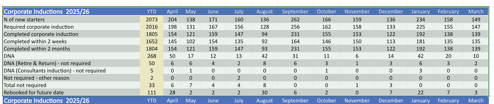
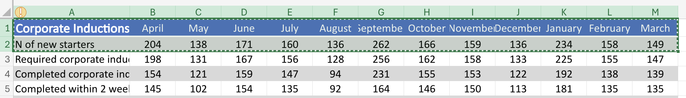
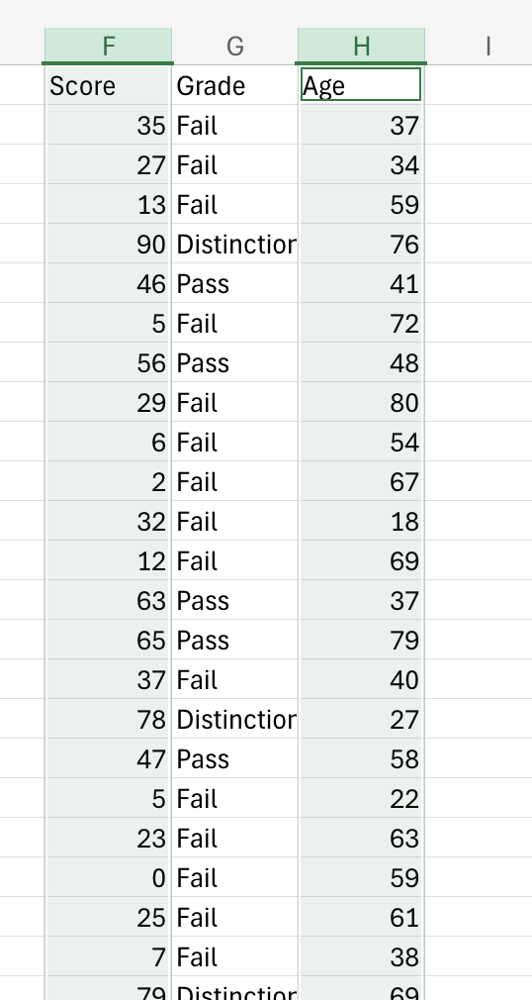

# Module 2 — Data Visualisation & Storytelling
### Barts Health NHS × La Fosse — Microsoft 365 Data Skills Training

**Day 1 | 11:45–13:00 | Platform: Excel Online, Power BI (overview), Microsoft Fabric (overview)**
**Two 30-minute blocks, with a 15-minute break between them**

---

## Pre-Session Setup

- Load Slidee: barts_module_1_2

## Training 

- `Slide 4`

### Training Overview

We're now moving into Module 2 where we're trying to answer our final question for the morning **how can you access the right information and choose the right visualisation to convey the information needed?**

This is where data stops being a spreadsheet and starts becoming a message. 

The analytical work we've done so far, cleaning, joining is all about producing numbers that are correct. 

Now we need to try and make those numbers useful. 

That involves selecting the right visual form, stripping away the noise that obscures the point we're trying to convey and framing the finding we made that prompts a decision rather than just an observation. 

The skills here aren't necessarily technical, building charts in Excel takes minutes. 

The harder and more valuable skill is knowing which chart to build, formatting it so the right thing stands out. Then how to frame it so your audience understands it immediately. 

Back on our Data Lifecycle, this module will cover **Visualisation** and the beginning of the **Communication** stage.

### The Training

## Block 1 - Choosing the Right Chart 

Let's get onto charts, there's many which we can choose from but if there's 3 I want you to really focus on it'll be:

1. Bar Charts
2. Pie Charts
3. Scatter Charts

### Bar Charts

Whether vertical or horizontal, **bar charts** are great for comparing values across distinct categories.

Think:
- which team
- which month
- which site

### Pie Charts

**Pie charts** are good for showing how a whole divides into parts, they're generally recommended when there's a few categories and the proportional relationship is the main emphasis of the message

### Scatter Charts

**Scatter Charts** on the other hand are best used for exploring whether two variables are related.

Like: "Does higher absence correlate with lower scores or overall completion of a course."

### Issues

Just to reiterate, the main purpose of choosing the right chart is to clearly convey a message to be acted upon. 

**Pie charts** with more than four or five segments, where the proportions become impossible to compare visually loose meaning. 

If we have **Bar charts** that don't start at zero, they can unitendidly exaggerate differences between categories. 

**Line charts**, if they're used for categorical data implies a continuous trend where none exists. 

### Why it matters

Which chart you choose isn't an aesthetic decision, it's worth think about it as an analytical one. 

The wrong chart type can make a meaningful pattern invisible. Or equally make a trivial difference look significant.

A habit we should all adopt is asking: "what question am I answering, and what visual form answers it most directly"

### Bad Charts

I've got some bad charts and hopefully we'll see where the meaning has gotten lost or obscured. 

- `Slide 5`

On the screen we have a breakdown of the number of students in each **Division**

**ASK**
- Any thoughts?

**ANSWER**
- Too many segments or divisions
- Difficult to see the meaning of the chart
- Makes us ask further questions

One thing we've not done with this dataset is clean it, which we should do. 

The largest segment of the chart is actually N/A.

For anyone viewing this chart, they'll fundamentally need to ask several follow up questions which the creator would then need to guide the viewer through. 

- `Slide 6`

Another chart I've created shows the gender split of apprentices.

**ASK**
- Thoughts?

**ASK**
- With only three categories I think a pie chart would better visualise the data
- Also at a glance you'd believe there were many many more, maybe 5 times as many males than females. 
  - That's because the graph starts at 700. 
  - In reality there's:
    - 708 *Females*
    - 753 *Males*
    - 739 who selected *Other*
  - The message of the visualisation changes quite dramatically 

- `Slide 7`

This is a better representation of the data and the message we're trying to convey. 

I've changed the scale on the y-axis and the title as well to tell the viewer what I want them to observe. 

Less questions to ask and more meaning. 

With this data specifically I think there's another improvement we can make and that's using a pie chart. 

- `Slide 8`

The main improvement with this chart in my opinion is that we've removed uncessary data for the point I'm trying to convey. 

What I want the viewer to understand is that according to the data the gender balance is fairly even.

It's not important that the viewer knows theres specifically:
- 708 *Females*
- 753 *Males*
- 739 who selected *Other*

This graph really quickly just shows the even distribution and the message lands straight away. 

I've got the numbers to back that up if people are curious but the graph is to convey a message for an action. 

The question to always ask yourself is when creating the chart is, **what is the one thing I want my audience to understand from this visual?** 

Then find the chart type that most directly answers that question. 

If you can summarise a chart with a single sentence, like: **"This chart shows that..."**, then your chart is focused. 

If that sentence contains multiple **"ands"**, consider splitting that message into multple charts instead. 

## Block 2 - Building & Decluttering Charts in Excel Online

Let's actually build some charts together. 

As I've said a few times, we need to be thoughtful when creating charts. 

The presentation of a chart is a reflection to the consideration we've taken regarding the underlying data. 

So although it may not seem that way, the presentation of our charts will correlate to whether the actions recommended are taken or not. 

We want our charts to be free of cluter. Again, not for aesthetic reasons - it's about removing everything that competes with the message.

- Gridlines
- Borders
- Redundant labels

Anything the readers eye has to move past before it reaches the data. The fewer things there are to look at, the faster and more accurately the findings land. 

Part of this is also shifting from descriptive to insight-led titles. It requires no technical skill - only the discipline of asking **"what does this chart show?"** and writing that as the title, instead of the conventional description of the axes. 

#### Line Charts

The first chart we'll go through will be a **line chart**. 

We should use line charts to visualise continuous data over time. 

If you think about:
- stock prices
- temperature 

Anything which is good for highlighting overall trends, recurring patterns or maybe most importantly predicting the future. 

What I want us to do is copy another file over to our personal folder. This time: `Dashboard L&D Activity`

- *Copy over 'Dashboard L&D Activity' to personal folder. 

Once we're there I'm just going to open the `Inductions` sheet and we should be able to see the Corporate Inductions for this year. 

We could gather all this information through an XLOOKUP but for sake of time I'm going to copy the top table and paste it into a new sheet. 

- *Create new sheet called*: 'Corporate Inductions'
- *Paste table into new sheet*

Then to create this graph I'm just going to trim this data by removing the **YTD: Year To Date** column.

What I'm going to try and show is the fluctuation of the number of new starters aligned with each month and the total isn't necessary for this exact visualisation. 

Remember one chart, one message. 

- *Delete column YTD*

Then I'm just going to highlight the data I care about.

And click on **Insert** -> **Line** -> **Line (top left)**

- *Create visualisation*

From the graph it looks like there's two peaks

There are two clear peaks:
- September with 262 starters
- January with 234 starters

This data will probably mean more to yourself but it looks like recruitment and onboarding activity is concentrated around the start of the academic year and the post-Christmas period as well. 

If that's the insight, what I need to do is make that really clear and update the title of the graph to convey that. 

- *Double click on chart*
- *Go to 'format' -> 'chart title'*
- *Add*: 'Intake peaks at beginning of academic year and calendar year'

#### Scatter Chart

The last chart we'll go through is a scatter chart. 

They're best deployed to visualise the relationship between two numerical variables and identify patterns that standard tables or bar charts might hide. 

They are particularly useful for finding correlations as well, especially if it's hard to see with the raw data. 

To generate some mock data I'm going to return to the **tracker** sheet inside the **student allocations** file. 

I'll create a new column called age and give each of our apprentices an age between 18 and 60. 

- *In cell H1 add*: 'Age'
- *In cell H2 add*: `=RANDBETWEEN(18,60)`
- *Auto fill down*

With our **age** and **score** we've got two pieces of numerical data which suits our scatter graph. 

I can copy these columns seperately into a new table.

On a Mac computer I can highlight one column, hold **command** and highlight a second. On windows I think you'd hold down **control** and highlight both columns. 

Then if we click on **Insert** and then **Scatter** we can choose the type of scatter graph we want to use. 

Once we've done that we need to consider the best way to showcase what we can see to any potential viewers.

I think with a scatter graph, unlike some of the other charts we created do need labels on the X and Y-Axis to convey the information. 

I'll double click on the chart and go to **Format**
- Then Horizontal Axis 
- There should be the ability to toggle an **Axis Title**
- *Add*: 'Score'

Then I'll repeat the process for the vertical axis and pass in 'Age'

Because both the scores and age are both randomly generated, there isn't any meaningful correlation but a negative finding is a finding nevertheless so I'll add that assessment to the **Chart Title**

- *Add*: No relation between student age and score

- Lastly, I'll toggle the **Legend** off as well

There's some features which aren't as accessible on the online version of Excel like trend lines but if the report could be benefited with one and you have Excel desktop, I've consider downloading this spreadhseet and adding a trendline to show the correlation even more clearly. 

### End of session Challenges

That's all we're going to look at today. 

As I mentioned this morning, on Sharepoint, you'll find some cheatsheets for the concepts we covered. 

There's a series of challenges I'd like you to look at.

All of the data exists inside `Apprentice KPI tables April 2026`

I'd love for you to create visualisations of your choice relating to the:
- Ethnic background of apprentices
- Then a visualisation about the breakdown of caring responsibilities, for those who have a caring responsibility

The choice of chart is up to you but also how to access that data initially as well. 

You can define your own table and write your own formulas or maybe use a Pivot Table. 

Think about what the data shows and give any visualisation a good title which conveys what the data suggests, once you've uncovered it. 

