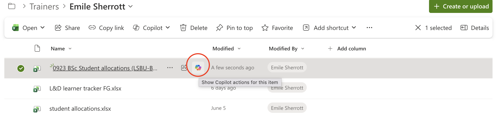
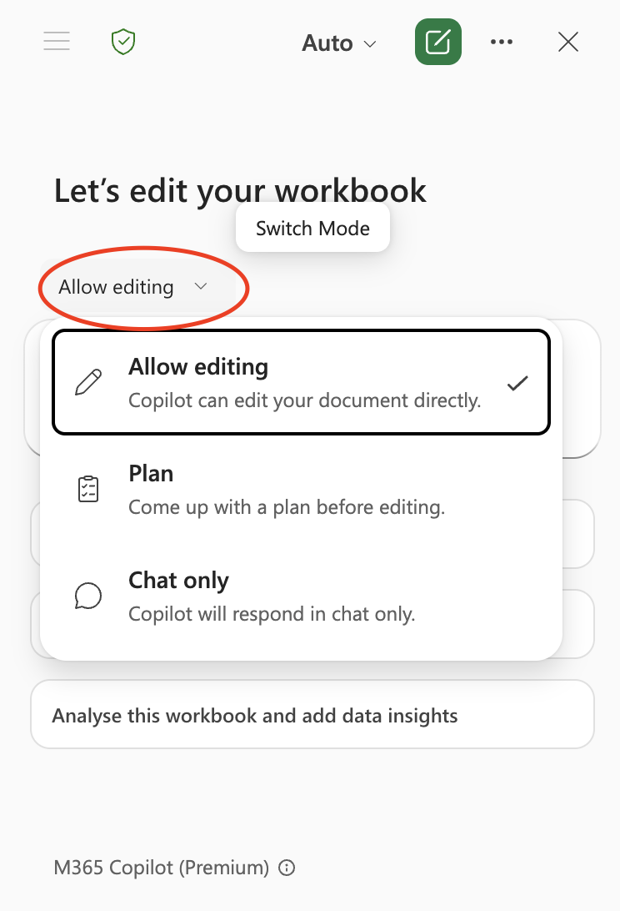

# Module 3 — Accelerating with Copilot
### Barts Health NHS × La Fosse — Microsoft 365 Data Skills Training

**Day 2 | 09:15–11:30 | Platform: Microsoft Copilot within Excel Online, PowerPoint Online, Word Online, Outlook, Teams**
**Four 30-minute blocks, with a 15-minute break after Block 3**

## Pre-Session Setup

- Load Slidee: barts_module_3_4

## Training

- `Slide 1`

### Recap

Hello everyone, good morning and welcome to the second part of the training we're doing on data presentation. 

I hope you've all been well since we last met. 

We're going to spend the day building on everything we covered in modules 1 and 2. 

Just to remind you, previously we manually completed a data workflow:

- accessing the data
- cleaning it
- analysing it with formulas:
  - xlookups
  - pivot tables
- then we took a look at the best ways to present that information with charts and insight-led titles

That took us the best part of the day, with a few actitivite thrown in the middle as well. 

Today we'll be looking to see, how much of that can be done faster with Microsoft CoPilot?

Fortunately, the answer is, quite a lot. 

For the right tasks, with that right prompts we can quicken a lot of those processes. I'll see this a lot of times throughout the day but with any action we use CoPilot for, there needs to be a human reviewing everything before it's shared. 

This hopefully speaks to the manner in which I want to approach today. 

CoPilot isn't about replacing the skills from modules 1 and 2, it's about applying them with greater speed and less effort. 

I appreciate in society there's a level of anxiety about AI quite broadly but CoPilot or any Large Language Model is only as trustworthy as the person who reviews their output. It can and does make mistakes. 

### What is an LLM?

Before we dive into CoPilot, I want to just explain what AI is in this context. 

I've used it before we whether it's;
- Microsoft CoPilot
- ChatGPT
- Claude AI

They're described as Large Language Model

- Human's learn langugage by reading, listening and generally interacting
- A LLM on the other hand learns patterns in language by processing enormous amounts of text. 

If I were to ask you to answer the question: *"The capital of France is?"*, as a human, we may have learnt the answer in school, through travelling to France or my just looking at a globe.

A Large Language Model consumes vast amounts of data from texts, documents, any data it can get access to. Rather than storing facts like a database, it learns patterns and relationships in that data. 

If I ask CoPilot: *"Why is the sky blue?"*, the AI won't look up each word to understand what it means but it'll understand themes in the prompt like: *"why"* in the prompt *"why is the sky blue"*. 

It'll recognise a pattern in the question and generate a response based on what it learned during training about concepts such as sky, light and colour. 

You may have heard the term *"AI training"* before and this is taking all that data and repeatedly asking it to predict missing words or phrases. Each time it gets something wrong, the model is adjusted slightly. After running billions or trillions of these adjustments, it becomes more accurate and useful in generating useful responses.  

So why am I telling you this?

Well, as humans, we can. make mistakes. That's no different to an AI. 

There's a term in AI called **hallucinations**

If the AI is trained on bad data or information then the answers it can generate may also be bad. 

In the context of Excel, spreadsheets and data visualisation. If Microsoft trains its model on all the public spreadsheets it has access to, a lot of them won't be formatted using best practice or indeed the standard the NHS will have. 

So just be careful. 

### Where does Module 3 sit in the Data Lifecycle

- `Slide 1`

We've seen this data lifecycle before. We'll be using coPilot across multiple stages simultaneously, which is a strength and its main risk as well. 

- It can help in this **analysis** stage, suggesting forumlas or summarising data
- The **visualisations** stage, generating draft charts from the data
- We can take it further into the **communication** stage as well, drafting emails, meeting summaries and any narrative text we want. 

The risk though is if we have any errors they can propagate quite quickly.

If CoPilot creates a wrong formula to assess some data, imagine if we don't catch up and we use CoPilot to create a chart off poor data and again use AI to create a slidedeck and a draft email which goes out to our team. 

So with each step of this data lifecycle, we'll need to check our work. 

## Block 1 - Effective Prompting & CoPilot in Excel

Let's look at some prompts to begin with. 

I'm going to delete the file: `0923 BSc Student allocations (LSBU-Barts Health)` from within our personal folder.

Last session we cleaned this file so we'll start a fresh with the raw data.

Then I'll copy over the file again from the root folder, back into my personal folder to work on it again.

From my folder we should be able to see a little CoPilot icon on the file.

CoPilot has access to the file you are working in, and other files and emails in your Micrsoft 365 environment, depending on your organisations settings. 

If we click on the button we should see:

1. Summarise
2. Create an FAQ
3. Ask a question
4. Create an agent

Again, quick and easy ways to query your data without needing to open it. 

Let me click on **Ask a question** and I'll ask: *"How many students are there?"*

I did this before so I hope I get the same output.

It said there's 35 students, based on the 35 distinct email entries in the spreadsheet. 

This is correct as far as the data goes and allows me to quickly get insights about the data but let's open the file.

- *Open file '0923 BSc Student allocations (LSBU-Barts Health)'*

So we can see in the data that there is no column for student name and the AI has had to use some assumptions about our data. This is where the human reviewing the output is important. 

We can approve the reasoning that if there's 35 distinct emails than the spreadsheet does actually have 35 students but I need to review how it came to that number before blindly taking 35 and sharing it with my team.

Once it's open we open the file though should see in the bottom right of the screen a little CoPilot symbol again. 

If I hover over it we'll see some options for:
1. Add data insights
2. Improve formatting
3. Add a formula

We'll explore these options soon but for now just click on the main logo again, which should open up a new window on the site of your screen. 

From here there's some more default options CoPilot is trying to suggest for us. 

One thing we can see is the current mode is to **Allow editing**

If we click onto that we'll see **Plan** and also **Chat only**.

The **Plan** option is a little more secure so instead of making changes directly to the data, we can see the updates first. 

Let's pick **Chat only** though. 

This will let us use CoPilot like any LLM and provide queries or prompts on anything we're interested in. 

Like any sort of grammer, there's a correct anatomy of what makes a good prompt. 
