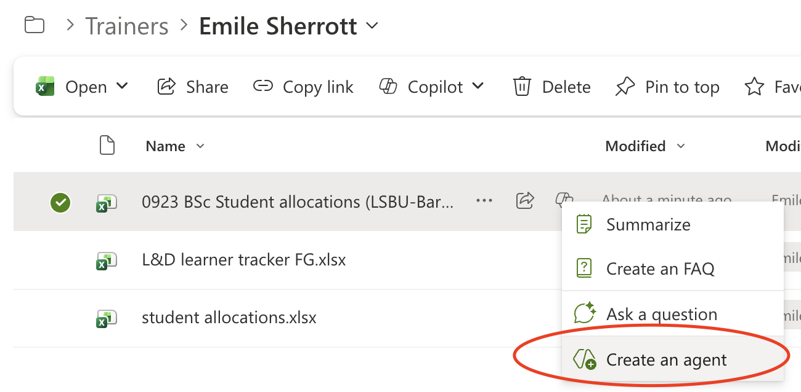
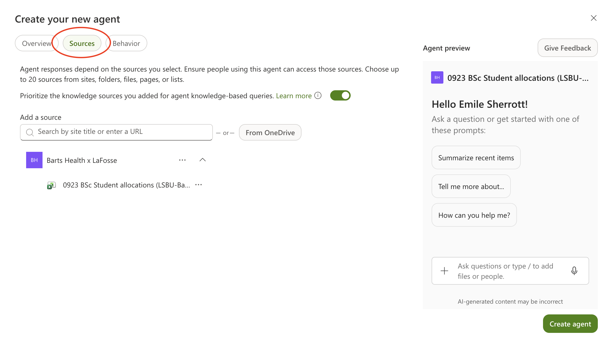
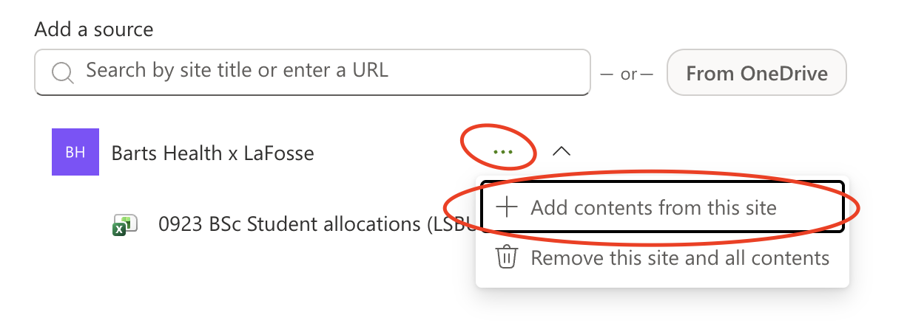
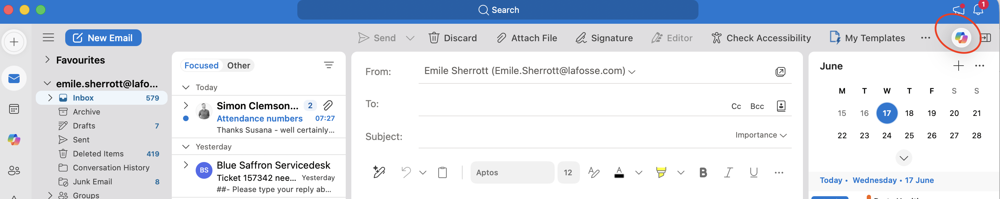

# Module 3 — Accelerating with Copilot
### Barts Health NHS × La Fosse — Microsoft 365 Data Skills Training

**Day 2 | 09:15–11:30 | Platform: Microsoft Copilot within Excel Online, PowerPoint Online, Word Online, Outlook, Teams**
**Four 30-minute blocks, with a 15-minute break after Block 3**

## Pre-Session Setup

- Load Slidee: barts_module_3_4

## Training

- `Slide 1`

### Recap

Hello everyone, good morning and welcome to the second part of the training we're doing on data presentation. 

I hope you've all been well since we last met. 

We're going to spend the day building on everything we covered in modules 1 and 2. 

Just to remind you, previously we manually completed a data workflow:

- accessing the data
- cleaning it
- analysing it with formulas:
  - xlookups
  - pivot tables
- then we took a look at the best ways to present that information with charts and insight-led titles

That took us the best part of the day, with a few actitivite thrown in the middle as well. 

Today we'll be looking to see, how much of that can be done faster with Microsoft CoPilot?

Fortunately, the answer is, quite a lot. 

For the right tasks, with that right prompts we can quicken a lot of those processes. I'll see this a lot of times throughout the day but with any action we use CoPilot for, there needs to be a human reviewing everything before it's shared. 

This hopefully speaks to the manner in which I want to approach today. 

CoPilot isn't about replacing the skills from modules 1 and 2, it's about applying them with greater speed and less effort. 

I appreciate in society there's a level of anxiety about AI quite broadly but CoPilot or any Large Language Model is only as trustworthy as the person who reviews their output. It can and does make mistakes. 

### What is an LLM?

Before we dive into CoPilot, I want to just explain what AI is in this context. 

I've used it before we whether it's;
- Microsoft CoPilot
- ChatGPT
- Claude AI

They're described as Large Language Model

- Human's learn langugage by reading, listening and generally interacting
- A LLM on the other hand learns patterns in language by processing enormous amounts of text. 

If I were to ask you to answer the question: *"The capital of France is?"*, as a human, we may have learnt the answer in school, through travelling to France or my just looking at a globe.

A Large Language Model consumes vast amounts of data from texts, documents, any data it can get access to. Rather than storing facts like a database, it learns patterns and relationships in that data. 

If I ask CoPilot: *"Why is the sky blue?"*, the AI won't look up each word to understand what it means but it'll understand themes in the prompt like: *"why"* in the prompt *"why is the sky blue"*. 

It'll recognise a pattern in the question and generate a response based on what it learned during training about concepts such as sky, light and colour. 

You may have heard the term *"AI training"* before and this is taking all that data and repeatedly asking it to predict missing words or phrases. Each time it gets something wrong, the model is adjusted slightly. After running billions or trillions of these adjustments, it becomes more accurate and useful in generating useful responses.  

So why am I telling you this?

Well, as humans, we can. make mistakes. That's no different to an AI. 

There's a term in AI called **hallucinations**

If the AI is trained on bad data or information then the answers it can generate may also be bad. 

In the context of Excel, spreadsheets and data visualisation. If Microsoft trains its model on all the public spreadsheets it has access to, a lot of them won't be formatted using best practice or indeed the standard the NHS will have. 

So just be careful. 

### Where does Module 3 sit in the Data Lifecycle

- `Slide 1`

We've seen this data lifecycle before. We'll be using coPilot across multiple stages simultaneously, which is a strength and its main risk as well. 

- It can help in this **analysis** stage, suggesting forumlas or summarising data
- The **visualisations** stage, generating draft charts from the data
- We can take it further into the **communication** stage as well, drafting emails, meeting summaries and any narrative text we want. 

The risk though is if we have any errors they can propagate quite quickly.

If CoPilot creates a wrong formula to assess some data, imagine if we don't catch up and we use CoPilot to create a chart off poor data and again use AI to create a slidedeck and a draft email which goes out to our team. 

So with each step of this data lifecycle, we'll need to check our work. 

## Block 1 - Effective Prompting & CoPilot in Excel

Let's look at some prompts to begin with. 

I'm going to delete the file: `0923 BSc Student allocations (LSBU-Barts Health)` from within our personal folder.

Last session we cleaned this file so we'll start a fresh with the raw data.

Then I'll copy over the file again from the root folder, back into my personal folder to work on it again.

From my folder we should be able to see a little CoPilot icon on the file.

CoPilot has access to the file you are working in, and other files and emails in your Micrsoft 365 environment, depending on your organisations settings. 

If we click on the button we should see:

1. Summarise
2. Create an FAQ
3. Ask a question
4. Create an agent

Again, quick and easy ways to query your data without needing to open it. 

Let me click on **Ask a question** and I'll ask: *"How many students are there?"*

I did this before so I hope I get the same output.

It said there's 35 students, based on the 35 distinct email entries in the spreadsheet. 

This is correct as far as the data goes and allows me to quickly get insights about the data but let's open the file.

- *Open file '0923 BSc Student allocations (LSBU-Barts Health)'*

So we can see in the data that there is no column for student name and the AI has had to use some assumptions about our data. This is where the human reviewing the output is important. 

We can approve the reasoning that if there's 35 distinct emails than the spreadsheet does actually have 35 students but I need to review how it came to that number before blindly taking 35 and sharing it with my team.

### Effective Prompting

Once it's open we open the file though should see in the bottom right of the screen a little CoPilot symbol again. 

If I hover over it we'll see some options for:
1. Add data insights
2. Improve formatting
3. Add a formula

We'll explore these options soon but for now just click on the main logo again, which should open up a new window on the site of your screen. 

From here there's some more default options CoPilot is trying to suggest for us. 

One thing we can see is the current mode is to **Allow editing**

If we click onto that we'll see **Plan** and also **Chat only**.

The **Plan** option is a little more secure so instead of making changes directly to the data, we can see the updates first. 

Let's pick **Chat only** though. 

This will let us use CoPilot like any LLM and provide queries or prompts on anything we're interested in. 

Like any sort of grammer, there's a correct anatomy of what makes a good prompt. 

- `Slide 2`

We should specify the:
- **role**: what do we want CoPilot to behave as
- **context**: what the data or document is about
- **task**: what you want CoPilot to do
- **constraints**: limits on format, length etc..
- **output format**: as a document, downloadable slide etc...

So if my role was a training lead I could ask Copilot.

- *Type as you say*

*"Act training lead for NHS Barts Trust, review this apprenticeship tracker spreadsheet and tell me which LL staff supervise the most students. Count distinct students and output the numbers as a list in descending order"*

If I then hit enter it'll crunch the numbers.

- *Hit Enter*

Again, the last time I did this it'll show you how it achieved the output and again, review the formula to make sure the reasoning stands up to your interpretation of the data. 

So the framework around: role / context / task / contrainsts and output is to get relevant information out of CoPilot.

### Prompting Mistakes

Common mistakes are being too vauge or asking multple unrelated questions in a single prompt. 

If I asked:

- *"Give me information about the LL staff"*, that wouldn't return any focused information

Or if I said:

- *"Give me information about placement dates and how many students have a surname beginning with A"*, again, it wouldn't be focused and the extra complexity can confuse the AI. 

### Main uses

There's three main uses I think you'll more commonly have for CoPilot though. 

1. Asking CoPilot to explain what a dataset contains and identify any quality issues
2. Asking CoPilot to suggest a formula for a specific task, i.e.:
  - *"write a formula that counts how many staff in column B that haven't completed training based on the value in column C"*
3. Asking CoPilot to summarise a column or table in plain English, which is a little like what we've done. 

So let me ask coPilot if there's any data quality issues. 

- *Type as you say*
- *"Can you identify any data quality issues with this spreadsheet"*

Again, quick and easy and we then decide how to approach the cleaning process.

### Cleaning Data

Last session we cleaned this file by:
- Removing white space
- Standardise Casing
- We standardised the values of the trust as well to have an **"Original Cohort"** column to seperate the different *Barts-continued* and *Barts extended* values we saw in the Trust column.
- Finally we filled in some values from other spreadsheets as well, we used the **student allocations** spreadsheet to find some information about **Quinn Martin** on Row 32.  

If we do this through CoPilot, it's my recommendation to do this one query at a time.

CoPilot will get things wrong and one big query to clean this file may cause errors. If we work incrementally then we can make changes as we go.

#### Prompt 1 - Trim Whitespace

Remove all leading and trailing whitespace from every cell in this spreadsheet. 

- So when we're done we should see the changes highlighted on our spreadsheet and if can click **Done** to confirm changes or simply undo the addition with a **ctrl + z** 

#### Prompt 2 - Standardise casing in column A

Standardise the text in column A to title case. 

#### Prompt 3 — Add the Original Cohort column

Insert one new column immediately to the right of column A. Name it "Original Cohort". For each row, copy the value from column A into this new column, then remove any suffixes including "-contin", "-continued", "-ext degree", and any similar variations, so that values read as their base cohort only. 

#### Prompt 4 — The lookup

In column L, some cells are empty. Fill only those empty cells using student_allocations.xlsx, which is in the same SharePoint folder as this file. Match students by email address — email is in column J of this spreadsheet and column D of student_allocations.xlsx. Where a match is found, copy the Clinical Area value from column A of student_allocations.xlsx. Do not create new columns. Do not overwrite cells in column L that already have a value.

#### Overview

Each of these prompts is actually quite long. 

They do the job we asked them quite well but there's a consideration to how much time we're actually saving. 

AI is always learning and improving and a lot of the time you may be better plced to do things manually. 

Where CoPilot really excels in relation to Excel spreadsheets are really in regards to:
- Using it as a data-quality check
- Using it to flag suspicious records for human review
- Or producing summaries of spreadsheets

These tasks which are repeatable, necessary and produce value are a good reason to use **CoPilot Agents**.

An agent lets you write instructions once, in full detail and save them as a prompt.

Every time we use the agent it'll understand the:
- context
- file structure
- column references

Let me undo all the changes and in `0923 BSc Student allocations (LSBU-Barts Health)` then I'll go back to the SharePoint to access the file again.

If we click on the **Create agent** button we'll be able to define some actions we want to repeatedly take. 

We'll be taken to a new window. I can see on the top a button called **Sources**

This will give the agent access to files we want it to be able to use and we can select 20. 

Then I can select the files I want. 

We can include all the files present in the Documents folder but I'll just add the files in my personal folder for the timebeing. 

- *Add*:
  - `0923 BSc Student allocations (LSBU-Barts Health)`
  - `L&D learner tracker FG`
  - `student allocations`

If we click on the **Behaviour** tab which sits next to **Sources** we can give the agent some behaviours. 

#### Welcome messaging

Under Welcome Messaging I'll add a little snippet about the agent. 

*Data Prep Agent - Audits the file and tells you what it found - blank cells, duplicates, text-stored numbers, inconsistent casing, etc..*

#### Starter prompts

The **starter prompts** are messages a user can see when they use the agent to understand the types of questions they can ask.

This agent I hope is going to make interacting with our raw data more truthworthy and less unpredictable so I'll add a few potential prompts someone may want to use. 

- * Review this workbook for data-quality issues. Find missing values, duplicate fields, inconsistent date formats, inconsistent capitalisation, extra whitespace, placeholder values, and columns containing free text instead of structured values. Suggest likely corrections where another sheet in this workbook supports the value, and label each suggestion High, Medium, or Low confidence. Return: Key issues / Suggested fixes / Records needing manual review*
- * Scan this workbook and flag suspicious records for human review. Focus on placeholder values, missing placement choices, unresolved notes, unexpected zero values, “Not found” entries, duplicated identifiers, and records where values conflict across sheets. For each flagged record, show: Record identifier / Suspicious field / Why it is suspicious / Possible correction if supported elsewhere in the workbook / Confidence level Return the result as a prioritised review list.*
- * Summarise this workbook for rapid review. Explain what each sheet contains, highlight repeated categories, common status values, missing-data hotspots, and notable patterns in placements, grades, outcomes, cohorts, departments, or sites. Do not estimate counts unless they are clearly visible in the sheet. Return: Workbook summary / Key trends / Data issues affecting interpretation / Follow-up questions for a reviewer*

What we hopefully can see is on the right hand side of the screen an **Agent overview** showing us how it'll look when we go to use it. 

#### Agent Instructions

Finally under **Agent instructions**, just to tell the agent it's role, limirations and the responses given.

*Provide accurate information about the selected files in a formal and professional tone. Keep responses concise, easy to scan, and focused on key findings. Prioritise identifying missing data, data quality issues, anomalies, and opportunities to populate missing values using information from other selected files. Present results as a small number of short bullet points, include confidence levels where values are suggested, and avoid lengthy explanations unless specifically requested. Ensure outputs are suitable for rapid review and exploration of newly received datasets.*

#### Overview

Finally, I'm going to click back into the **Overview** tab and just give the agent a name: **Data Prep Agent**

- *Click 'Create agent'*

Once it's created, we should be able to see the resource in our personal folder and we're able to use those prompts repeatedly. 

We're able to edit this and give the agent overview of new files when they arrive and perform these tasks quickly at the initial stage of our data lifecycle. 

One thing you may have noticed if you've used agents before is that they perform much weaker if you try to prompt the agent to make changes directly to the files. 

My recommendation would be if this is something you care to use CoPilot to do, I'd recommend doing so directly from the file itself and using CoPilot from there. 

What the agent will do instead is give you formulas or scripts to copy and paste. 

The training the AI recieves, we can assume will always be improving but right now we're not quite at the point where we can do full automation. 

## Block 2 - CoPilot in PowerPoint & Word

Let's take a look trying to use CoPilot to create some visualisations. 

I'm going to use: `Apprentice KPI tables April 2026`

- *Open 'L&D learner tracker FG'*

I've been asked to present back to the group regarding the ethnic background of our apprentices in each of the staff groups. 

Potentially to see if there's an over or under representation of any ethnicity by group. 

I know how to create a Pivot Table but I can delegate this responsibility to CoPilot. 

So if I open CoPilot on the worksheet let me write a quick prompt. 

- *Make sure CoPilot allows editing*

- *Create a pivot table on a new sheet with a primary row of staff group and a column of ethnicity then for values a count of name ignoring staff groups of N/A and blank*

Once that's created we can click **Done**

It's at this stage I want to generate a visualisation for a PowerPoint Presentation I'll be presenting in a couple of days. 

- *Create a stacked bar chart for total count in each staff group, broken down by ethnicity*

- *Wait for chart to be created*

Based on the chart, it's clear that there's no a even distribution of ethnicities in each staff group - which is something I can report back.

I want to change the chart title to cut through any noise and land this message.

Both the pivot table and chart, despite being created by CoPilot, we can customise ourself, so I'm going to take the opportunity to do this. 

- *Edit chart heading to*: 'Even distribution of ethnicities amongst Staff Groups'

This is where I believe a huge benefit to using CoPilot is.

With the CoPilot Agent, currently it's really useful for summarising data or seeing links within the data. 

When you have lots of new files to constantly asses an agent is the right choice. 

Once you understand the raw data you have acces to and need to go deeper to extract information from the data then using CoPilot to generate formulas or in our case Pivot Tables and visualisations will save you time.

### PowerPoint

I now want to put this all together in an actual powerpoint.

Another limitation of CoPilot right now is cross service creation. 

We can't easily use to CoPilot in Excel and ask it to create a PowerPoint deck. 

So what I'll do is from my personal folderis create an empty PowerPoint and copy the graph I created over. 

- *Create a new PowerPoint and copy the chart into Slide 1*

Then using CoPilot built into PowerPoint I can run a prompt specific to that service.

- *Add a new slide with 3 key insights regarding the ethnic spread of apprentices amongst the staff groups using the chart*

CoPilot may prompt us for additional information if it wants more context about the style or tone of any new slides and it's at our discretion about the input we give it. 

Generally speaking I will prefer a:
- concise
- minimal and professional tone

It may also prompt us as where to create the slide
- before
- after
- or overwriting what we already have

My main takeaway is the service you want to use. Whether it's:
- excel
- word
- powerpoint

Create a file for that service first and then use the specific CoPilot for that tool.

Let's try and take this to Word as well. 

- *Create a new Word file*

Now in CoPilot for Word I can provide my prompt to generate a one page summary. 

- *Act as an NHS Barts Health administrator reviewing workforce equality data. Analyse the data provided below showing the distribution of ethnicities across staff groups and provide a concise summary of the overall pattern, focusing on whether ethnicity representation is broadly evenly distributed across staff groups and highlighting any notable variations. Present the output as a short professional paragraph followed by 3–4 key takeaway bullet points suitable for inclusion in a report or presentation.*

- *Copy in the pivot table from Excel*

- *Hit enter*

Use of CoPilot in PowerPoint or Excel can be a game changer when it comes to producing a report or slide deck really quickly.

What CoPilot usually gets right is the **structure** and **coverage** in response to the prompt you gave. 

Though sometimes the formatting, especially with PowerPoint almost always needs some manual correction. 

You can try to write another prompt but generally, you'll find yourself chasing your own tail getting AI to fix an AI mistake. 

Where you're most likely to use CoPilot in Word will be:

- Drafting a narrative summary from data like we've done. 
- Or Rewriting a section for a different tone or audience. Perhaps you've received some copy or data from your line mananger and you want to copy that data into word and share it with your team. 
- Lastly, you'll get good use if you want to summarise a long document and extract any key points or action items. 

### Hands On

I want to give you a go at doing something similar. 

I'm interested to see a breakdown regarding the average age of the apprentices from each site. 

This isn't a test you on your ability to create pivot tables. 

I'd recommend a:
- row of *site*
- a value of the average age

I'd also recommend you do two more things, round the average age to 0 decimal places and also look at the *count of name* for those values. 

It'll show that some sites have far more people than others. 

With this information I want you to do a few things.

- Use CoPilot to recommend a chart type to display the **site** and **avergae** age information
  - Create that chart and clean it the way you think is best
- Use CoPilot to generate a slide deck with 3 slides

1. For the chart you choose
2. For 3 key insights
3. An explanation for the outliers

### End of Hands On

I hope you enjoyed that.

The most time-consuming part of producing a report or presentation isn't the analysis - but the drafting, writing, structuring of slides. 

The output you got from CoPilot should be that first draft. 

CoPilot won't understand Barts Health's reporting conventions, the specific context behind the numbers, nor the preferences and priorities of the stakeholder receiving the output.

What CoPilot will do is created a plausable Word Document or Slidedeck but it'll often miss the specific finding or takeaway with makes a report worth reading. 

So treat CoPilot as your starting point rather than the endpoint. 

## Block 3 - CoPilot Across Teams & Outlook 

We can deloy CoPilot equally in other Microsoft 365 products like Teams and Outlook. 

I won't speak on this for too long but there's still value to be hard.

### Teams

I've taken the liberty of creating a fake teams conversation. 

Imagine you've had a meeting and you've got a conversation thread. 

I've asked Simon and another colleague of mine to have a scripted conversation about how apprentices are performing across several sites. 

- *Open teams chat* **Barts Health**

Equally if this was a teams video meeting, we could enable transcription to generate this text.

Based on a chat or transcript we can use CoPilot to summarise meeting notes or:
- key discussion points
- decisions made
- actions agreed
- or any owners and deadlines identified 

# CONTINUE
*Use fake chat and CoPilot to output a summary of discussion and any actions worth taking*

### Outlook

Moving into Outlook we can use CoPilot for three main uses.

1. To draft an email from a prompt
  - *"Draft an email to my team summarising October's mandatory training completion figures and asking for a response on any teams below 80% by Friday"*

2. Or we can use CoPilot to summarise a long email thread to extract the current status or any outstanding actions without reading every message

3. And suggesting a reply to an email, which can be then edited for tone and accuracy. 

I'll quickly demo this by using the summary I generated from the teams conversation and use CoPilot again to write a quick email to my team to try and get some insights from the data. 

# CONTINUE

*Use Teams chat summery to create an email prompt to ask team to try and get some insights from the data*

